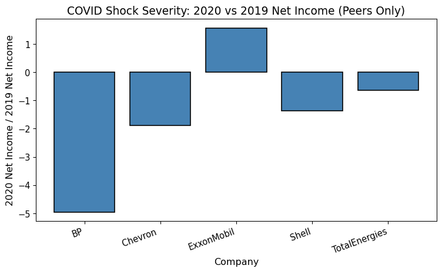
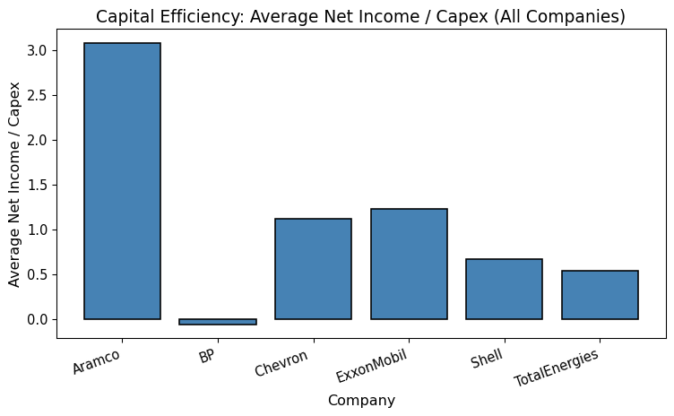
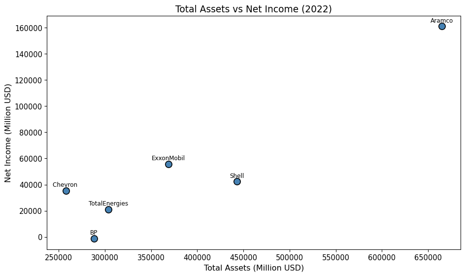
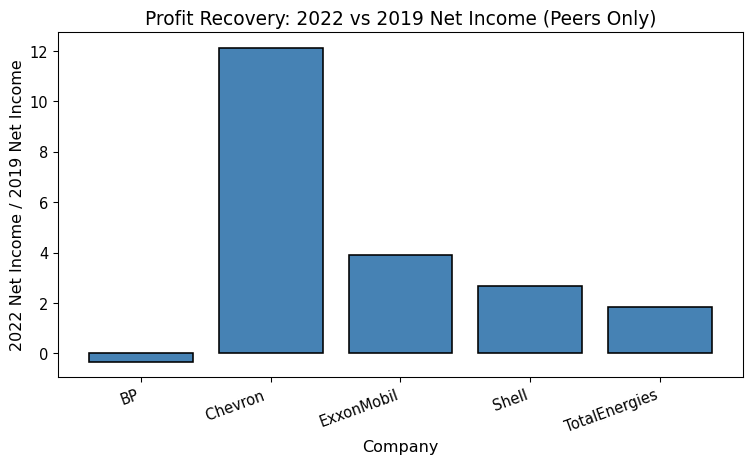
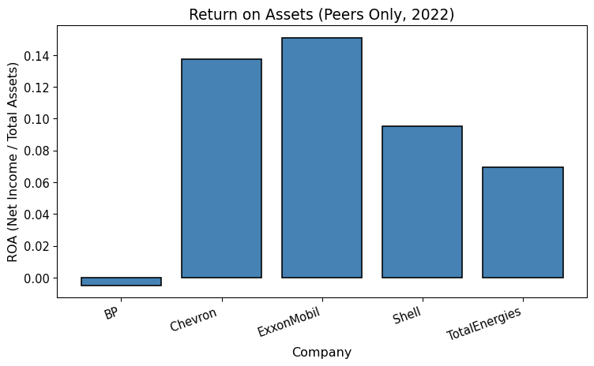

# Post COVID Recovery in Oil and Gas


# Post-COVID Recovery in Oil & Gas: Identifying the Top Performer

The 2020 COVID crash devastated the oil & gas industry. This analysis
measures three dimensions of post-COVID performance—profit recovery,
capital efficiency, and asset productivity—to identify the
top-performing Western oil company.

## Quick Start: How to Run This Analysis

### Requirements

- Python 3.8+
- Required libraries: pandas, matplotlib (see requirements.txt)

### Setup

1.  Clone this repository
2.  Install dependencies: `pip install -r requirements.txt`
3.  Ensure data file exists: `data/Oil and Gas Major Companies.csv`

### Running the Analysis

- **Jupyter Notebook:** Open
  `notebooks/Data Wrangling Final Project.ipynb`
- **Quarto (GitHub-ready markdown):**
  `quarto render readme.qmd --to gfm`
- **Output:** Generates `readme.md` for GitHub display

### Repository Structure

    Post-COVID-recovery-in-Oil-and-Gas/
    ├── data/
    │   └── Oil and Gas Major Companies.csv    # Financial data (2018-2022)
    ├── notebooks/
    │   └── Data Wrangling Final Project.ipynb # Jupyter version of analysis
    ├── readme.qmd                             # Quarto markdown (this file)
    ├── readme.md                              # GitHub-rendered output
    └── requirements.txt                       # Python dependencies

## 1. Load and Prepare Data

This dataset includes annual financial metrics for six major oil
companies from 2018–2022.

``` python
import pandas as pd
import matplotlib.pyplot as plt

plt.rcParams["font.size"] = 12
plt.rcParams["axes.titlesize"] = 14
plt.rcParams["axes.labelsize"] = 12
plt.rcParams["xtick.labelsize"] = 11
plt.rcParams["ytick.labelsize"] = 11
```

``` python
csv_filename = "data/Oil and Gas Major Companies.csv"
df = pd.read_csv(csv_filename)
display(df.head())
```

<div>
<style scoped>
    .dataframe tbody tr th:only-of-type {
        vertical-align: middle;
    }
&#10;    .dataframe tbody tr th {
        vertical-align: top;
    }
&#10;    .dataframe thead th {
        text-align: right;
    }
</style>

|  | Item (all numbers in Million USD unless stated otherwise) | Year | Aramco | Chevron | ExxonMobil | BP | TotalEnergies | Shell |
|----|----|----|----|----|----|----|----|----|
| 0 | Net income | 2018 | 111071.0 | 14824.0 | 20840.0 | 9578.0 | 11550.0 | 23352.0 |
| 1 | Operating/production Cost | 2018 | 14987.0 | 20544.0 | 36682.0 | 23005.0 | 27484.0 | 26970.0 |
| 2 | Avg Hydrocarbon Production, Million BPDOE | 2018 | 13.6 | 2.9 | 3.8 | 2.5 | 2.8 | 3.7 |
| 3 | Number of emplyees | 2018 | 67947.0 | 45047.0 | 71000.0 | 73000.0 | 104460.0 | 82000.0 |
| 4 | Total Equity | 2018 | 274249.0 | 155642.0 | 198528.0 | 101548.0 | 118114.0 | 202534.0 |

</div>

``` python
if df.columns[0] != "Variable":
    df = df.rename(columns={df.columns[0]: "Variable"})
```

``` python
long_df = pd.melt(
    df,
    id_vars=["Variable", "Year"],
    var_name="Company",
    value_name="Value"
)
```

``` python
metrics = long_df.pivot_table(
    index=["Year", "Company"],
    columns="Variable",
    values="Value"
).reset_index()

metrics.columns.name = None
metrics = metrics.rename(columns={"Capital Expenditure ": "Capital Expenditure"})
```

``` python
metrics.head()
```

<div>
<style scoped>
    .dataframe tbody tr th:only-of-type {
        vertical-align: middle;
    }
&#10;    .dataframe tbody tr th {
        vertical-align: top;
    }
&#10;    .dataframe thead th {
        text-align: right;
    }
</style>

|  | Year | Company | Avg Hydrocarbon Production, Million BPDOE | Capital Expenditure | Net income | Number of emplyees | Operating/production Cost | Total Assets | Total Equity |
|----|----|----|----|----|----|----|----|----|----|
| 0 | 2018 | Aramco | 13.6 | 35138.0 | 111071.0 | 67947.0 | 14987.0 | 359171.0 | 274249.0 |
| 1 | 2018 | BP | 2.5 | 25088.0 | 9578.0 | 73000.0 | 23005.0 | 282176.0 | 101548.0 |
| 2 | 2018 | Chevron | 2.9 | 13792.0 | 14824.0 | 45047.0 | 20544.0 | 253863.0 | 155642.0 |
| 3 | 2018 | ExxonMobil | 3.8 | 25923.0 | 20840.0 | 71000.0 | 36682.0 | 346196.0 | 198528.0 |
| 4 | 2018 | Shell | 3.7 | 23011.0 | 23352.0 | 82000.0 | 26970.0 | 399194.0 | 202534.0 |

</div>

## 2. Metrics & Performance Visualizations

These visuals summarize each dimension of post-COVID performance.

Metrics and charts appear in the same order as used in the analysis.

Three metrics quantify post-COVID performance:

- **Recovery Ratio (2022 vs 2019):** 2022 earnings divided by pre-COVID
  2019 baseline.
- **NI/Capex (2018-2022 Average):** Net income per capital dollar spent,
  averaged over the full period.
- **ROA (2022):** Net income divided by total assets.

Saudi Aramco is excluded from peer comparisons; analysis focuses on
Western competitors in open markets.

``` python
all_companies = sorted(metrics["Company"].unique())
peer_companies = [c for c in all_companies if c != "Aramco"]
metrics["NI_to_CAPEX"] = metrics["Net income"] / metrics["Capital Expenditure"]
```

``` python
ni_2019_2022 = metrics[metrics["Year"].isin([2019, 2022])]
recovery_summary = (
    ni_2019_2022.pivot(index="Company", columns="Year", values="Net income")
    .rename(columns={2019: "Net_income_2019", 2022: "Net_income_2022"})
    .reset_index()
)
recovery_summary["Recovery_Ratio"] = (
    recovery_summary["Net_income_2022"] / recovery_summary["Net_income_2019"]
)
```

``` python
metrics_2022 = metrics[metrics["Year"] == 2022].copy()
metrics_2022["ROA"] = metrics_2022["Net income"] / metrics_2022["Total Assets"]
```

``` python
ni_capex_avg = (
    metrics.groupby("Company")["NI_to_CAPEX"]
    .mean()
    .reset_index()
    .rename(columns={"NI_to_CAPEX": "NI_to_CAPEX_avg"})
)
ni_capex_avg["NI_to_CAPEX"] = ni_capex_avg["NI_to_CAPEX_avg"]
```

``` python
recovery_peers = recovery_summary[recovery_summary["Company"].isin(peer_companies)]
ni_capex_avg_peers = ni_capex_avg[ni_capex_avg["Company"].isin(peer_companies)]
metrics_2022_peers = metrics_2022[metrics_2022["Company"].isin(peer_companies)]
```

``` python
ni_2019_2020 = metrics[metrics["Year"].isin([2019, 2020])]
shock_summary = (
    ni_2019_2020.pivot(index="Company", columns="Year", values="Net income")
    .rename(columns={2019: "NI_2019", 2020: "NI_2020"})
    .reset_index()
)
shock_summary["Shock_Severity"] = shock_summary["NI_2020"] / shock_summary["NI_2019"]
shock_peers = shock_summary[shock_summary["Company"].isin(peer_companies)]
```

### COVID Shock Severity

``` python
if 'shock_peers' in globals():
    plt.figure(figsize=(8, 5))
    plt.bar(shock_peers["Company"], shock_peers["Shock_Severity"], color="steelblue", edgecolor="black", linewidth=1.2)
    plt.title("COVID Shock Severity: 2020 vs 2019 Net Income (Peers Only)")
    plt.xlabel("Company")
    plt.ylabel("2020 Net Income / 2019 Net Income")
    plt.xticks(rotation=20, ha="right")
    plt.tight_layout()
    plt.show()
else:
    print("Error: 'shock_peers' is not defined. Please run all previous cells to generate the required data.")
```



**Figure 1:** All Western peers experienced earnings collapse in 2020.

### Net Income Trends

``` python
plt.figure(figsize=(10, 6))
for company in all_companies:
    sub = metrics[metrics["Company"] == company]
    plt.plot(sub["Year"], sub["Net income"], marker="o", label=company, linewidth=2)

plt.title("Net Income of Major Oil & Gas Companies (2018-2022)")
plt.xlabel("Year")
plt.ylabel("Net Income (Million USD)")
plt.legend()
plt.tight_layout()
plt.show()
```


**Figure 2:** Universal 2020 collapse; 2021–2022 recovery paths reveal
operational differences.

### Capital Efficiency (All Companies)

``` python
ni_capex_avg_all = metrics.groupby("Company")["NI_to_CAPEX"].mean().reset_index()
plt.figure(figsize=(8, 5))
plt.bar(ni_capex_avg_all["Company"], ni_capex_avg_all["NI_to_CAPEX"], color="steelblue", edgecolor="black", linewidth=1.2)
plt.title("Capital Efficiency: Average Net Income / Capex (All Companies)")
plt.xlabel("Company")
plt.ylabel("Average Net Income / Capex")
plt.xticks(rotation=20, ha="right")
plt.tight_layout()
plt.show()
```



**Figure 3:** Firms differ significantly in how much net income they
generate per capital dollar invested.

### Total Assets vs Net Income (2022)

``` python
metrics_2022_all = metrics[metrics["Year"] == 2022]
plt.figure(figsize=(10, 6))
plt.scatter(
    metrics_2022_all["Total Assets"],
    metrics_2022_all["Net income"],
    s=100,
    color="steelblue",
    edgecolor="black",
    linewidth=1.2,
)
for _, row in metrics_2022_all.iterrows():
    plt.text(
        row["Total Assets"],
        row["Net income"] + 0.02 * metrics_2022_all["Net income"].max(),
        row["Company"],
        fontsize=9,
        ha="center",
    )
plt.title("Total Assets vs Net Income (2022)")
plt.xlabel("Total Assets (Million USD)")
plt.ylabel("Net Income (Million USD)")
plt.tight_layout()
plt.show()
```



**Figure 4:** Larger asset bases do not guarantee higher net income;
returns vary by firm.

### Profit Recovery (Peers Only)

``` python
plt.figure(figsize=(8, 5))
plt.bar(recovery_peers["Company"], recovery_peers["Recovery_Ratio"], color="steelblue", edgecolor="black", linewidth=1.2)
plt.title("Profit Recovery: 2022 vs 2019 Net Income (Peers Only)")
plt.xlabel("Company")
plt.ylabel("2022 Net Income / 2019 Net Income")
plt.xticks(rotation=20, ha="right")
plt.tight_layout()
plt.show()
```



**Figure 5:** Recovery ratios vary widely; ExxonMobil led peer recovery.

### Capital Efficiency (Peers Only)

``` python
plt.figure(figsize=(8, 5))
plt.bar(
    ni_capex_avg_peers["Company"],
    ni_capex_avg_peers["NI_to_CAPEX"],
    color="steelblue",
    edgecolor="black",
    linewidth=1.2,
)
plt.title("Capital Efficiency: Average Net Income / Capex (Peers Only)")
plt.xlabel("Company")
plt.ylabel("Average Net Income / Capex")
plt.xticks(rotation=20, ha="right")
plt.tight_layout()
plt.show()
```


**Figure 6:** ExxonMobil sustained highest average capital efficiency.

### Return on Assets (Peers Only)

``` python
plt.figure(figsize=(8, 5))
plt.bar(
    metrics_2022_peers["Company"],
    metrics_2022_peers["ROA"],
    color="steelblue",
    edgecolor="black",
    linewidth=1.2,
)
plt.title("Return on Assets (Peers Only, 2022)")
plt.xlabel("Company")
plt.ylabel("ROA (Net Income / Total Assets)")
plt.xticks(rotation=20, ha="right")
plt.tight_layout()
plt.show()
```



**Figure 7:** ExxonMobil maintained the highest ROA among peers in 2022.

## 3. Peer Ranking

``` python
ranking_df = pd.DataFrame({
    "Company": recovery_peers["Company"],
    "Recovery_Ratio": recovery_peers["Recovery_Ratio"],
    "NI_Capex_Avg": ni_capex_avg_peers["NI_to_CAPEX"],
    "ROA_2022": metrics_2022_peers["ROA"].values
}).sort_values("Recovery_Ratio", ascending=False).reset_index(drop=True)
```

This DataFrame ranks peers by recovery ratio and includes capital
efficiency and ROA for comparison.

## 4. Winner

Based on the combined performance metrics, the leading firm becomes
clear.

**ExxonMobil** leads across all three metrics: highest recovery ratio,
highest average NI/Capex, and highest ROA.

## 5. Conclusion

ExxonMobil’s consistent outperformance across recovery, efficiency, and
ROA demonstrates operational discipline in capital-intensive industries.
This systematic excellence across independent dimensions reflects a
sustained structural advantage over Western peers.

## Appendix

**Data Source:** Oil and Gas Major Companies.csv (2018-2022 financials)

**Companies Analyzed:** Aramco, BP, Chevron, ExxonMobil, Shell,
TotalEnergies

**Metrics Definition:**

- **Recovery Ratio:** 2022 net income ÷ 2019 net income (pre-COVID
  baseline)
- **NI/Capex:** Average net income ÷ capital expenditure (2018–2022)
- **ROA:** Net income ÷ total assets (2022)
